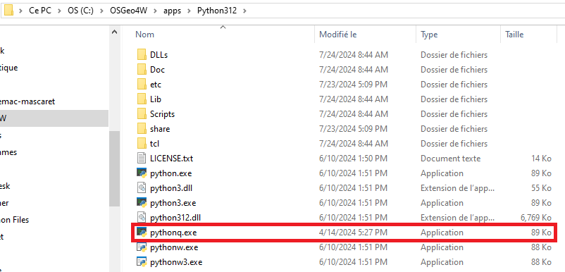
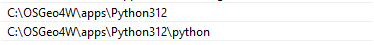
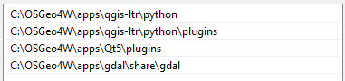

<div style="text-align: center;">
    <h1>TIF to CSV with pyqgis</h1>
</div>

## Requirements

You need to install and setup OSGeo4W if you don't have it. In case you have it you can try the following instruction, but in case it does not work, don't hesitate to reinstall it.

You can watch this video, it is quite well explained, but you should not have the same version as the guy who explains, so you should not look for the QGIS folder but instead for the OSGeo4W one which is usually at the root of your computer (default installation location during the setup) or at the location you installed it.

[](https://www.youtube.com/watch?v=9i16cFZy5M4&t=149s)

If you did not understand well the video here is a summary of what is explained in the it.

1. First you should go to the python configuration of your OSGeo4W to make a copy of the python executable of QGIS and give it a name that you would recognize easily. Here as you can see I renamed it `pythonq` to ease the call then. Indeed if you don't change the name of the python executable, it may never be called as you may have another python version out of QGIS. It should be in a similar directory as this one:


1. Then you should go to the environment variables. Try typing it in the Windows search bar and click on `Modifier les variables d'environnement pour votre compte`, because pyqgis does not require to have special privileges to run it. For the following, I need to warn you, the paths I put in my variables correspond to my system configuration and especially the OSGeo4W configuration. If you did not install OSGeo4W at the same location as me, the paths will change a bit.

2. For the `Path` or `PATH` variable, you should **Add** those kind of paths:


3. For the `PYTHONPATH` variable, if it does not exist create it, and then add these paths: 

## Run

Then you should just have to run the script you want, among the both there are in this repo. For instance to run `conver_csv_with_interface.py`:
```
pythonq convert_csv_with_interface.py
```

You should privilege the file that involves an interface as it is easier to use.

**Warning**, to run `convert_csv_with_path.py`, you will have to change the path assigned to the **FOLDER_PATH** variable in `utils.variables.py` by one of your path toward a GEE extraction folder. 